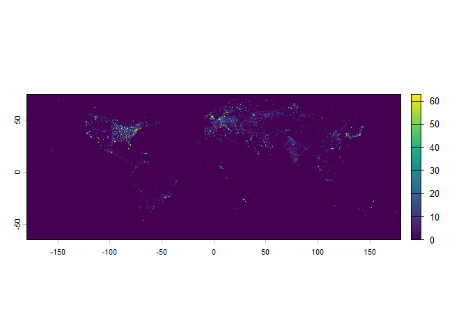
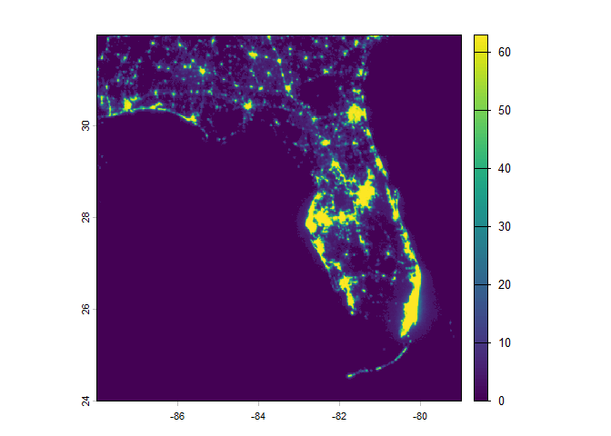
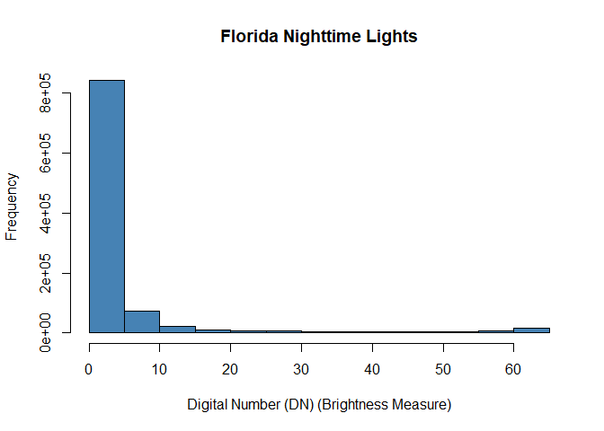

Initial Script- Exploring Satellite Image
================

Using Data from
<https://www.ngdc.noaa.gov/eog/dmsp/downloadV4composites.html>

``` r
#install terra package needed for working with raster data (gridded spatial data like this satellite imagery)
#install.packages("terra")
```

``` r
library(terra)
```

    ## terra 1.8.80

``` r
# rast() reads the TIFF file into a SpatRaster object allowing us to crop, visualize, and analyze global nighttime light intensity values
lights <- rast("C:/Users/mpp24/OneDrive/Documents/coastal-light-pollution-analysis/data/raw/F152000.v4b_web.stable_lights.avg_vis.tif")
```

``` r
#First look at data set
plot(lights)
```

<!-- -->

``` r
#Explore dataset
lights
```

    ## class       : SpatRaster 
    ## size        : 16801, 43201, 1  (nrow, ncol, nlyr)
    ## resolution  : 0.008333333, 0.008333333  (x, y)
    ## extent      : -180.0042, 180.0042, -65.00417, 75.00417  (xmin, xmax, ymin, ymax)
    ## coord. ref. : lon/lat WGS 84 (EPSG:4326) 
    ## source      : F152000.v4b_web.stable_lights.avg_vis.tif 
    ## name        : F152000.v4b_web.stable_lights.avg_vis

``` r
summary(lights)
```

    ## Warning: [summary] used a sample

    ##  F152000.v4b_web.stable_lights.avg_vis
    ##  Min.   : 0.0000                      
    ##  1st Qu.: 0.0000                      
    ##  Median : 0.0000                      
    ##  Mean   : 0.4653                      
    ##  3rd Qu.: 0.0000                      
    ##  Max.   :63.0000

``` r
head(lights)
```

    ##   F152000.v4b_web.stable_lights.avg_vis
    ## 1                                     0
    ## 2                                     0
    ## 3                                     0
    ## 4                                     0
    ## 5                                     0
    ## 6                                     0

``` r
#Right now raster is global-millions of pixels! Let's zoom in to just Florida.
#Florida roughly spans -88 Longitude to -79 Longitude, 24 Latitude to 32 Latitude
fl_bbox <- ext(-88, -79, 24, 32) #Create a rough extent
fl_lights <- crop(lights, fl_bbox) #Crop raster
```

``` r
#Check out new cropped area
fl_lights
```

    ## class       : SpatRaster 
    ## size        : 960, 1080, 1  (nrow, ncol, nlyr)
    ## resolution  : 0.008333333, 0.008333333  (x, y)
    ## extent      : -87.99583, -78.99583, 23.99583, 31.99583  (xmin, xmax, ymin, ymax)
    ## coord. ref. : lon/lat WGS 84 (EPSG:4326) 
    ## source(s)   : memory
    ## varname     : F152000.v4b_web.stable_lights.avg_vis 
    ## name        : F152000.v4b_web.stable_lights.avg_vis 
    ## min value   :                                     0 
    ## max value   :                                    63

``` r
plot(fl_lights)
```

<!-- -->

``` r
#Notice size is now 960 X 1080 instead of 16801 X 43201
```

``` r
#Look at distribution of light intensity in Florida

hist(fl_lights, maxpixels = 200000,
     main = "Florida Nighttime Lights",
     xlab = "Digital Number (DN) (Brightness Measure)",
     col = "steelblue")
```

    ## Warning: [hist] a sample of 97% of the cells was used

    ## Warning in plot.window(xlim, ylim, log, ...): "maxpixels" is not a graphical
    ## parameter

    ## Warning in title(main = main, sub = sub, xlab = xlab, ylab = ylab, ...):
    ## "maxpixels" is not a graphical parameter

    ## Warning in axis(1, ...): "maxpixels" is not a graphical parameter

    ## Warning in axis(2, at = yt, ...): "maxpixels" is not a graphical parameter

<!-- -->

``` r
#Will dive into units more later, but higher digital number (DN)= brighter lights
#Will need to change scale of y axis, adjust bin size, etc.
```
